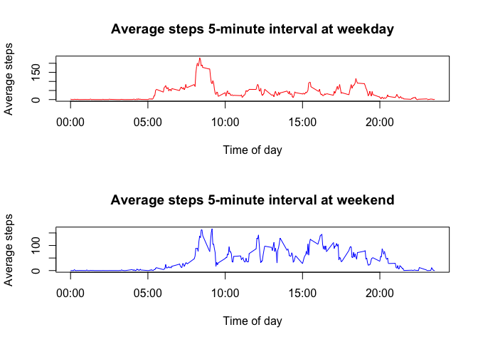

# Reproducible Research: Peer Assessment 1

## Loading and preprocessing the data

```r
data <- read.csv("activity.csv")
```


## What is mean total number of steps taken per day?

```r
hist(tapply(data$steps, data$date, sum), xlab = "Total daily steps", breaks = 20, 
    main = "Total of steps taken per day")
```

 

```r
total.daily.steps <- as.numeric(tapply(data$steps, data$date, sum))
step.mean <- mean(total.daily.steps, na.rm = TRUE)
step.median <- median(total.daily.steps, na.rm = TRUE)

step.mean
```

```
## [1] 10766
```

```r
step.median
```

```
## [1] 10765
```

The mean and median are 10766.19 and 10765 respectively

## What is the average daily activity pattern?

```r
data$interval <- as.factor(as.character(data$interval))
interval.mean <- as.numeric(tapply(data$steps, data$interval, mean, na.rm = TRUE))
intervals <- data.frame(intervals = as.numeric(levels(data$interval)), interval.mean)
intervals <- intervals[order(intervals$intervals), ]

labels <- c("00:00", "05:00", "10:00", "15:00", "20:00")
labels.at <- seq(0, 2000, 500)
plot(intervals$intervals, intervals$interval.mean, type = "l", main = "Average steps 5-minute interval", 
    ylab = "Average steps", xlab = "Time of day", xaxt = "n")
axis(side = 1, at = labels.at, labels = labels)
```

 

```r
intervals.sorted <- intervals[order(intervals$interval.mean, decreasing = TRUE), 
    ]
head(intervals.sorted)
```

```
##     intervals interval.mean
## 272       835         206.2
## 273       840         195.9
## 275       850         183.4
## 274       845         179.6
## 271       830         177.3
## 269       820         171.2
```

```r
max.interval <- intervals.sorted$intervals[1[1]]
max.interval
```

```
## [1] 835
```

The maximum number of steps are 835

## Imputing missing values
Note that there are a number of days/intervals where there are missing values (coded as NA). The presence of missing days may introduce bias into some calculations or summaries of the data.

```r
dim(data[is.na(data$steps), ])[1]
```

```
## [1] 2304
```

Number of missing value is 2304

Fill all of the missing values in the dataset to the mean values for that 5-minute interval.


```r
# 
steps <- vector()
for (i in 1:dim(data)[1]) {
  if (is.na(data$steps[i])) {
    steps <- c(steps, intervals$interval.mean[intervals$intervals == data$interval[i]])
  } else {
    steps <- c(steps, data$steps[i])
  }
}


activity_without_missing_data <- data.frame(steps = steps, date = data$date, 
                                            interval = data$interval)
```
Creating Histogram without missing data


```r
hist(tapply(activity_without_missing_data$steps, activity_without_missing_data$date, sum), xlab = "Total daily steps", breaks = 20, 
     main = "Total of steps taken per day")
```

 

## Are there differences in activity patterns between weekdays and weekends?

```r
weekday.or.weekend <- function(date) {
    day <- weekdays(date)
    if (day %in% c("Monday", "Tuesday", "Wednesday", "Thursday", "Friday"))
        return("weekday")
    else if (day %in% c("Saturday", "Sunday"))
        return("weekend")
    else
        stop("invalid date")
}
activity_without_missing_data$date <- as.Date(activity_without_missing_data$date)
activity_without_missing_data$day <- sapply(activity_without_missing_data$date, FUN=weekday.or.weekend)
```

Classify by weekend and weekday and repeat the previous process. Create a new factor variable with two factor levels in the dataset - 
weekday and weekend - indicating whether a given date is a weekday or weekend day.


```r
activity_without_missing_data$day.type <- c("weekend", "weekday", "weekday", 
                                            "weekday", "weekday", "weekday", "weekend")[as.POSIXlt(activity_without_missing_data$date)$wday + 1]
activity_without_missing_data$day.type <- as.factor(activity_without_missing_data$day.type)

weekday <- activity_without_missing_data[activity_without_missing_data$day.type == 
                                           "weekday", ]
weekend <- activity_without_missing_data[activity_without_missing_data$day.type == 
                                           "weekend", ]
weekday.means <- as.numeric(tapply(weekday$steps, weekday$interval, mean))
weekend.means <- as.numeric(tapply(weekend$steps, weekend$interval, mean))

intervals.day.type <- data.frame(intervals = as.numeric(levels(data$interval)), 
                                 weekday.means, weekend.means)
intervals.day.type <- intervals.day.type[order(intervals.day.type$intervals), 
                                        ]
```

Plotting two time series - weekdays/weekends - of the 5-minute intervals and average number of steps taken.


```r
par <- par(mfrow = c(2, 1))
plot(intervals.day.type$intervals, intervals.day.type$weekday.means, type = "l", 
    col = "red", ylab = "Average steps", xlab = "Time of day", main = "Average steps 5-minute interval at weekday", 
    xaxt = "n")
axis(side = 1, at = labels.at, labels = labels)
plot(intervals.day.type$intervals, intervals.day.type$weekend.means, type = "l", 
    col = "blue", ylab = "Average steps", xlab = "Time of day", main = "Average steps 5-minute interval at weekend", 
    xaxt = "n")
axis(side = 1, at = labels.at, labels = labels)
```

 
